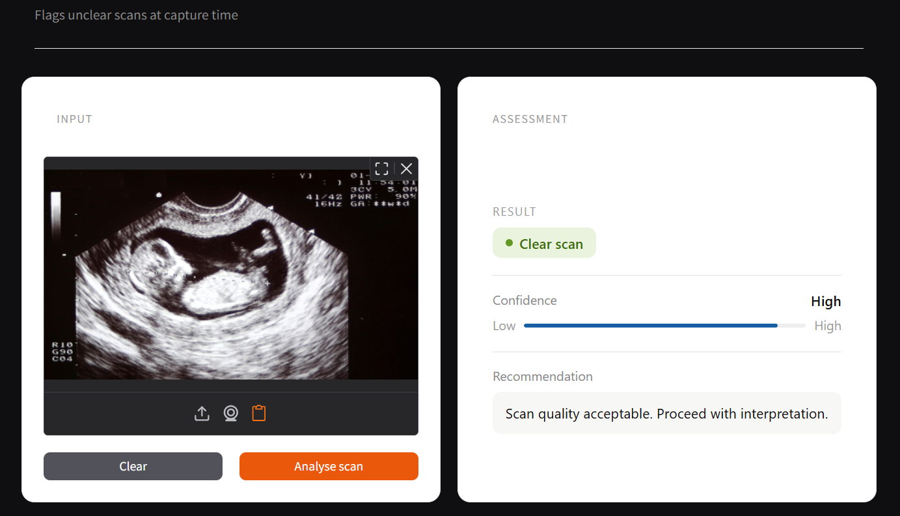
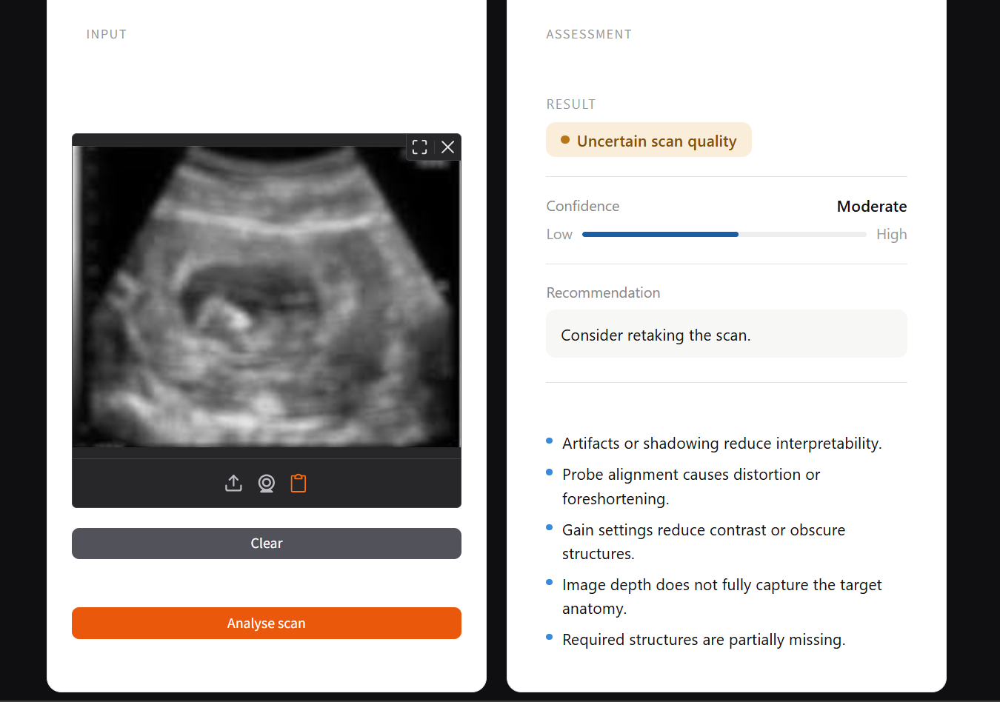

# Ultrasound Scan Quality — Demo

A minimal Gradio app that flags unclear ultrasound scans using a RAG-backed quality assessment pipeline.


## Screenshots


**Clear scan result:**




**Uncertain scan with quality notes:**




## Overview

The app accepts an uploaded ultrasound image, runs a scan quality classifier, and returns:
- A result badge — **Clear**, **Unclear**, or **Uncertain**
- A confidence level
- Plain-English quality notes retrieved from a guideline knowledge base


## Project structure

```
your-project/
├── app.py                  ← Gradio app (main entry point)
├── chunks.json             ← POCUS quality guideline text chunks
├── embeddings_local.json   ← Pre-computed chunk embeddings
└── requirements.txt
```


## Setup

1. Clone or download the repository
2. Install dependencies:
   ```bash
   pip install -r requirements.txt
   ```
3. Run the app:
   ```bash
   python app.py
   ```
4. Open [http://localhost:7860](http://localhost:7860) in your browser


## Dependencies

- `gradio >= 5.0`
- `pillow`
- `numpy`


## How it works

The classifier is currently a placeholder for demo purposes. The RAG pipeline is fully functional — it uses keyword overlap to match the uploaded scan context against a set of POCUS image quality guidelines (`chunks.json`), then maps matching chunks to one of five quality categories:

| Category | Description |
|---|---|
| **Depth** | Image depth does not fully capture target anatomy |
| **Gain** | Gain settings reduce contrast or obscure structures |
| **Alignment** | Probe alignment causes distortion or foreshortening |
| **Coverage** | Required structures are partially missing |
| **Artifact** | Shadowing or artifacts reduce interpretability |
